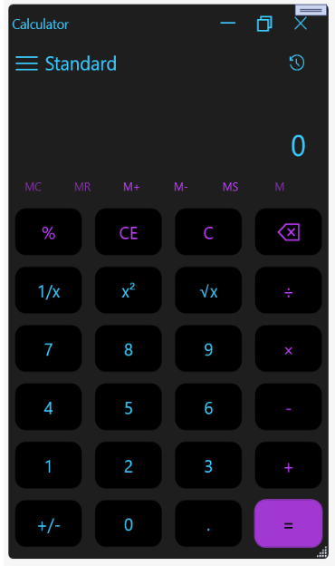

# 🧮 WPF Calculator Application

A simple yet functional calculator application built using **Windows Presentation Foundation (WPF)** with the **MVVM (Model-View-ViewModel)** architectural pattern. This app demonstrates best practices in clean code, XAML styling, and MVVM separation of concerns.

---

## 📁 Project Structure

```
├── Converter/                  # Custom value converters
├── Model/                     # Data and business logic models
├── Styles/                    # XAML styles and resource dictionaries
├── ViewModel/                 # ViewModel classes with binding logic
├── AboutWindow.xaml           # About window interface
├── AboutWindow.xaml.cs        # Code-behind for AboutWindow
├── App.xaml                   # Application entry and resources
├── App.xaml.cs                # Code-behind for App
├── AssemblyInfo.cs            # Assembly metadata
├── CalculatorApp.csproj       # Project file
├── CalculatorApp.sln          # Visual Studio solution file
├── Capture.PNG                # Screenshot 1
├── myCalci.PNG                # Screenshot 2
├── MainWindow.xaml            # Main calculator UI
├── MainWindow.xaml.cs         # Main window logic
```

---

## 🚀 Features

- Perform basic arithmetic operations: ➕ ➖ ✖️ ➗  
- Well-structured MVVM architecture  
- Custom value converters  
- Resource dictionary for styles  
- About window  
- Responsive and clean UI  

---

## 🛠️ Getting Started — Create Your Own WPF MVVM Project

### 1. Prerequisites

- [Visual Studio](https://visualstudio.microsoft.com/) with **.NET Desktop Development** workload
- .NET 5, .NET 6, or .NET Framework installed

### 2. Create a New Project

- Launch Visual Studio
- Click **"Create a new project"**
- Select **WPF App (.NET Core)** or **WPF App (.NET Framework)**
- Name your project `CalculatorApp` and click Create

### 3. Set Up Folder Structure

In **Solution Explorer**, create these folders:

```
/Model
/ViewModel
/Converter
/Styles
```

### 4. Add and Connect Files

- `MainWindow.xaml` – Add calculator UI components  
- `MainWindow.xaml.cs` – Link DataContext to ViewModel  
- `MainViewModel.cs` – Contains UI logic and bindings  
- `CalculatorModel.cs` – Logic for calculations  
- `BoolToVisibilityConverter.cs` – Value converter for UI visibility  
- `App.xaml` – Add global styles and resources  

Bind the ViewModel like this in `MainWindow.xaml.cs`:

```csharp
this.DataContext = new MainViewModel();
```

### 5. Implement MVVM Logic

- Use `INotifyPropertyChanged` in your ViewModel  
- Implement commands using `ICommand` and `RelayCommand`  
- Delegate operations to the model from ViewModel  

### 6. Add XAML Styles

Create a `ResourceDictionary.xaml` in the `Styles/` folder:

```xml
<SolidColorBrush x:Key="PrimaryColor" Color="#FF6200EE"/>
```

Then reference it in `App.xaml`:

```xml
<Application.Resources>
    <ResourceDictionary Source="Styles/ResourceDictionary.xaml"/>
</Application.Resources>
```

### 7. Run the Project

- Build with `Ctrl + Shift + B`
- Run with `F5` or click the **Start** button

---

## 🖼️ Screenshots

### Main Calculator UI




---

## 📌 Technologies Used

- C#
- WPF (XAML)
- MVVM Design Pattern
- Visual Studio
- .NET Framework / .NET Core

---


## 🙋‍♀️ Author

Developed with ❤️ by S Rashmi
